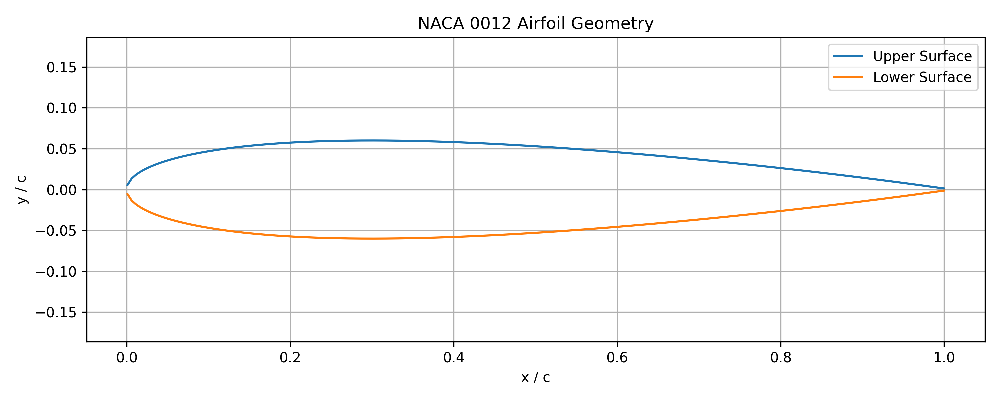
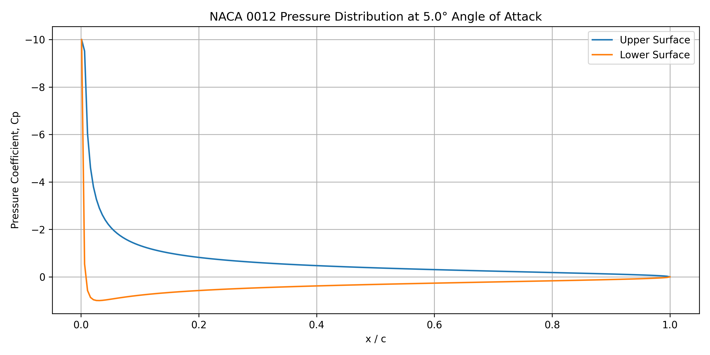

# NACA 0012 Airfoil Analysis

A Python-based analysis of the NACA 0012 airfoil using numerical calculations and visualization.

## Project Overview

This project creates the geometry of a NACA 0012 airfoil and analyzes its aerodynamic properties at a selected angle of attack.

The project calculates:

- Airfoil geometry
- Lift coefficient
- Pressure coefficient
- Pressure distribution

## Airfoil

The NACA 0012 is a symmetrical airfoil with:

- 0% camber
- 12% maximum thickness relative to chord

## Method

The airfoil geometry is generated using the NACA 4-digit airfoil thickness equation.

The lift coefficient is estimated using:

Cl = 2π α

where α is the angle of attack in radians.

A simplified pressure coefficient model is also used to visualize the pressure distribution.

## Technologies

- Python
- NumPy
- Matplotlib

## Results

### NACA 0012 Geometry

### Pressure Distribution

## Future Improvements

- Implement a panel method
- Calculate drag coefficient
- Analyze multiple angles of attack
- Compare results with published aerodynamic data
- Develop a higher-fidelity CFD model

## Author

Daniel John
